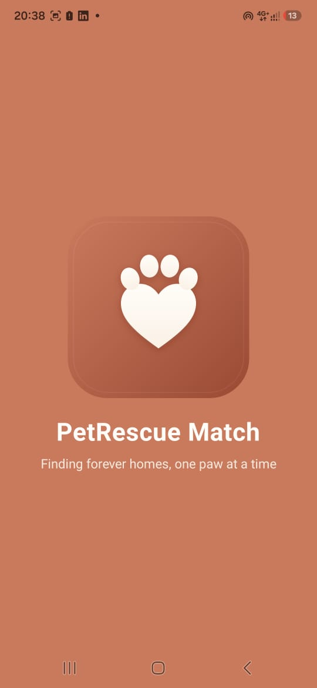
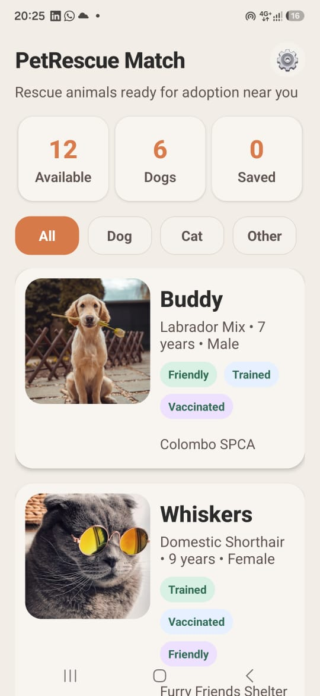
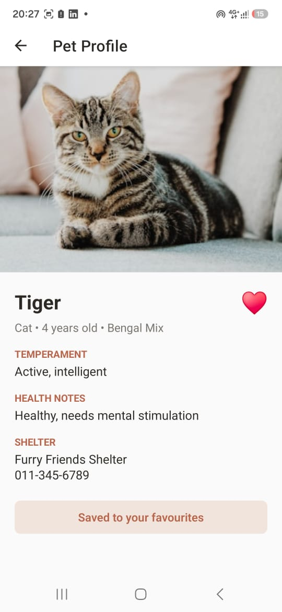
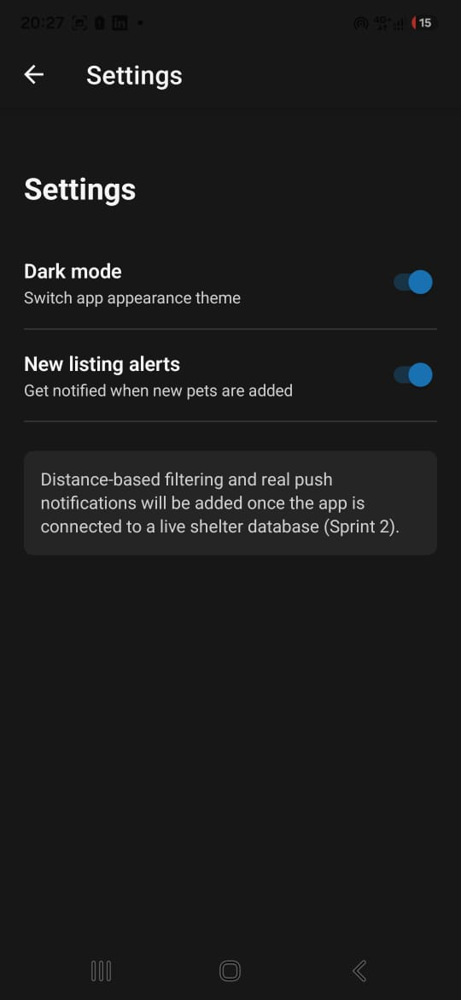

# PetRescue Match

## Target Domain
Animal Welfare & Community Rescue

## Problem Statement
Local shelters struggle to get visibility for rescue animals available for immediate adoption, resulting in extended shelter stays and poor adoption outcomes. Many animals remain unseen because the information is fragmented, difficult to browse, and not presented in a simple mobile-friendly format.

## Application Solution
PetRescue Match is a React Native Expo app that helps users browse adoptable pets from local shelters. It provides a simple and friendly listing interface so adopters can quickly find animals by type, view detailed care and health information, and save profiles they are interested in.

### Features
- Home screen with a searchable/filtered pet list using a FlatList
- Filter by species: All, Dog, Cat, Other
- Detailed pet profile screen with age, temperament, health notes, and shelter contact details
- Favorite toggle using useState
- Settings screen with notification toggle
- Local data model for prototype sprint

## App Structure
- App.js — navigation setup
- data/pets.js — local pet dataset
- screens/HomeScreen.js — pet list and filtering
- screens/DetailScreen.js — individual pet details and favorite state
- screens/SettingsScreen.js — settings and notification preferences

## Setup Instructions
1. Install dependencies:
   ```bash
   npm install
   ```
2. Start the Expo app:
   ```bash
   npm start
   ```
3. Scan the QR code with Expo Go on Android, or run in an emulator.

## Screenshots

### Landing Screen


### Home Screen


### Pet Detail Screen


### Settings Screen


## Assessment Alignment
This app satisfies the Sprint 1 prototype requirements:
- 3+ screens (Landing, Home, Detail, Settings)
- FlatList with 10+ items (12 adoptable pets from local data array)
- At least 2 useState hooks (selectedSpecies, isFavourited, notificationsOn, theme toggle)
- Mobile navigation and state changes working across all screens
- README with target domain, problem statement, and setup instructions
- Bonus: Dark/Light mode toggle, custom logo, and splash screen

## Author
**Ravija Karunanayake**  
Student No: 80001636

## Course & Assignment
CSI2114 - Mobile Application Development  
Sprint 1 Prototype: React Native Pet Adoption App
